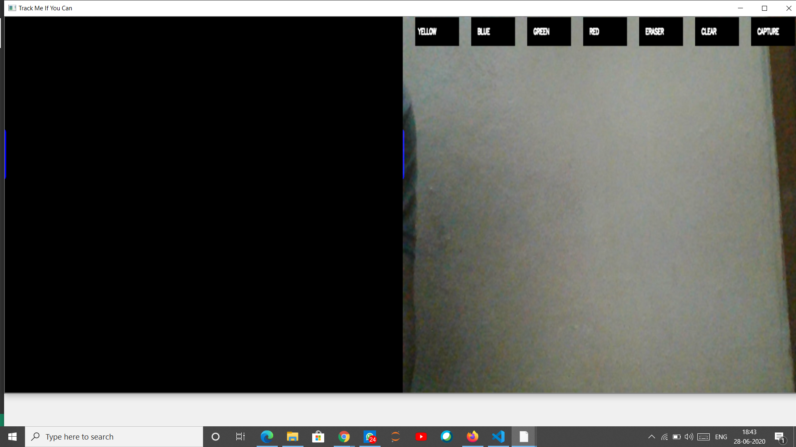

# Air-Writing-To-Speech
# 
<b>Air-Writing-To-Speech</b> is an application that converts our air signs to text later to speech. Click [Air-Writing-To-Speech](https://bit.ly/COVID-RACE-GAME-download-version1)

[](https://github.com/developers-cosmos/Air-Writing-To-Speech/graphs/commit-activity)  


## Run :runner:

To run the Game on your desktop clone the repository and run the below command.<br>
Requires python-3 and pip installed.

```python
pip install -r requirements.txt
python "app.py"
```

## Downloads

* To download the application without any setup [click here.](https://bit.ly/COVID-RACE-GAME-download-version1)

## Notes on Air-Writing-speech

* After installing dependencies and running the file you will get the image as  
* Here we need to choose th color of object
* This is the place where we work.
* 
* If you want to save your you will drag the object towards capture.

# Thank you :smile:
